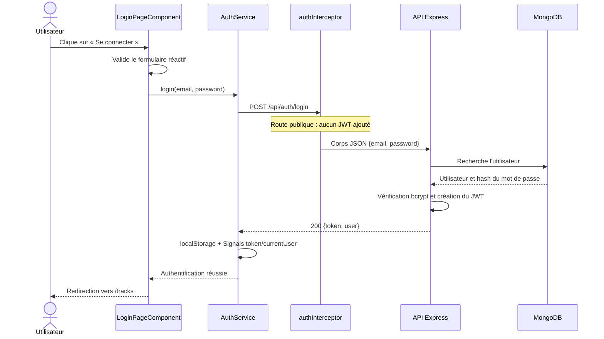
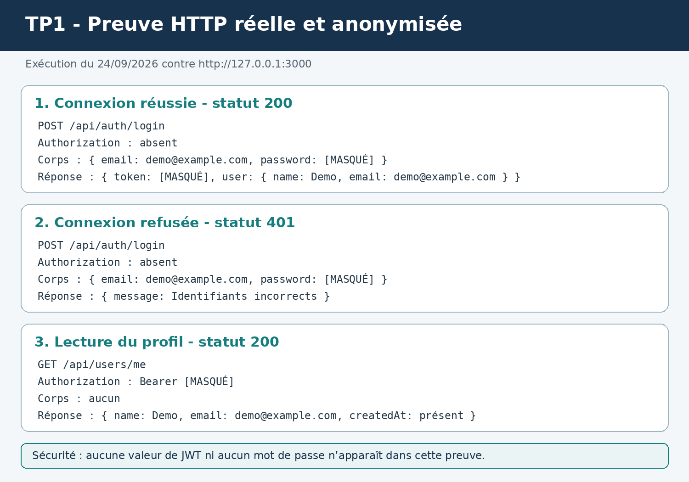

# Livrables TP1 - Authentification et profil

## 1. Code frontend complété

La partie utilisateur est organisée en trois couches :

- les composants affichent les formulaires et les messages :
  `frontend-starter/src/app/components/login-page/`,
  `register-page/`, `profile-page/` et `app/` ;
- `frontend-starter/src/app/shared/services/auth.service.ts` centralise les
  appels HTTP et l'état d'authentification ;
- `auth.guard.ts` protège les pages et `auth.interceptor.ts` ajoute le JWT aux
  requêtes privées et traite les réponses `401`.

Le frontend couvre l'inscription, la connexion, la déconnexion, le chargement
du profil, la modification du nom, les validations, les messages d'erreur et
la redirection lorsqu'un JWT est invalide ou expiré.

## 2. Schéma annoté du flux de connexion



Chemin des fichiers :

```text
login-page.html
  → LoginPageComponent.submit()
  → AuthService.login()
  → HttpClient
  → authInterceptor
  → POST /api/auth/login
  → backend/src/app.js
  → backend/src/models/User.js
  → MongoDB Atlas
```

## 3. Preuve Network / HTTP



Cette preuve a été produite contre le backend réellement connecté à MongoDB
Atlas le 24 septembre 2026. Elle couvre :

- une connexion réussie : `POST /api/auth/login`, statut `200` ;
- une connexion refusée : `POST /api/auth/login`, statut `401` ;
- une lecture du profil : `GET /api/users/me`, statut `200`, avec
  `Authorization: Bearer [MASQUÉ]`.

Le navigateur pilotable n'étant pas disponible dans l'environnement de
l'assistant, il s'agit d'une trace HTTP automatisée et non d'une capture de
l'onglet DevTools. Le mot de passe et le JWT sont volontairement masqués.

## 4. Signal et `localStorage`

Un **Signal Angular** conserve un état réactif en mémoire. Quand sa valeur
change, les parties du template qui le lisent sont automatiquement mises à
jour. Il disparaît lorsque l'application est complètement rechargée.

`localStorage` est un stockage persistant du navigateur. Sa valeur reste
présente après un rechargement ou une fermeture du navigateur, mais elle n'est
pas réactive : Angular ne met pas automatiquement l'interface à jour lorsqu'une
clé change.

Dans ce projet, le JWT est conservé dans `localStorage` sous la clé
`gpc_token` pour restaurer la session. Le Signal `token` représente cet état
dans Angular, tandis que `currentUser` contient les données publiques de
l'utilisateur. Le mot de passe n'est jamais sauvegardé.

## 5. Vérifications

- `npm test` dans `frontend-starter/` : **4 tests réussis sur 4** ;
- `npm run build` dans `frontend-starter/` : **réussi** ;
- `npm test` dans `backend/` : **2 tests réussis sur 2** ;
- connexion réelle à MongoDB Atlas : **réussie** ;
- connexion acceptée : **HTTP 200** ;
- connexion refusée : **HTTP 401** ;
- lecture authentifiée du profil : **HTTP 200**.

Une explication plus détaillée est disponible dans
[`output/pdf/guide_verification_tp1_authentification_profil.pdf`](output/pdf/guide_verification_tp1_authentification_profil.pdf).
